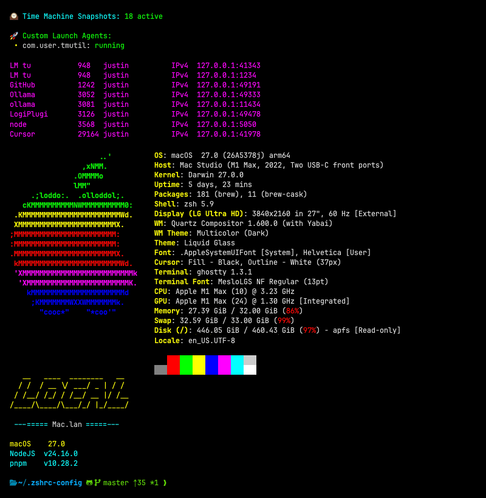

#  zshrc-config

**One config tree, eight host profiles, auto-detected.**

Open a terminal on your personal Mac, your work Mac, a Linux box, inside Docker, in VS Code, or as a Codex agent shell, the same repo detects where it's running and loads the right profile, automatically. Startup is measured, not assumed: a Codex agent shell boots in **~56 ms**; a full interactive terminal in **~550 ms**.

<table width="100%" bgcolor="#000000"><tr><td align="center">

</td></tr></table>

Under the hood it's a small, deliberate system: `lib/` holds pure function definitions that do nothing until called, `profiles/` declares what each host wants, and one loader resolves the two together in a fixed, documented order.

A [maintainer CLI](#zconf---the-maintainer-cli) lints that contract on every push, so the rules stay enforced rather than just documented.

---

## What's inside

```
~/.zshrc-config/
├── bootstrap/            # Ordered early init: profiling → compinit → Antidote/plugins → prompt
│   ├── 00-profiling.zsh  #   ZSHRC_PROFILE=1 hook for a per-function zprof breakdown
│   ├── 01-antidote.zsh   #   plugin manager bootstrap (skipped in containers)
│   ├── 02-plugins.zsh    #   sources the generated plugin bundle
│   ├── 03-compinit.zsh   #   completion system - must precede plugins
│   └── 04-prompt.zsh     #   Powerlevel10k config
│
├── core/                 # zsh-level settings only - no output, no side effects
│   ├── detect.zsh        #   is-agent-shell / is-ide-shell / is-container predicates
│   ├── env.zsh           #   determine-environment → resolves $ZENV, once
│   ├── profile.zsh       #   the manifest loader (see Profiles, below)
│   ├── options.zsh       #   setopt, history, completion styling
│   └── locale.zsh
│
├── lib/                  # Definitions only. Sourcing a file here must do NOTHING.
│   ├── colors.zsh        #   ${_c}-style ANSI vars, guarded so re-sourcing is free
│   ├── git/               #   git.core, .commit, .rebase, .maintenance, .stashes, .tags, .submodule
│   ├── node/               #   nvm-autoload, pnpm, npm/global-install helpers
│   ├── clean/              #   node_modules / browser cache / IDE cache cleanup (all --dry-run capable)
│   ├── macos/              #   Homebrew prefix detection, Time Machine, dock, media
│   ├── utils/              #   disk usage, and the rest of lib/utils.zsh (ports, tar, IP)
│   ├── cli/                #   listing (eza/tree), navigation
│   ├── dev/, paths/        #   dev workflow helpers; per-OS PATH ownership
│   └── fzf.zsh, doctor.zsh, splash.zsh, zconf.zsh, ...
│
├── vendor/               # Third-party runtime init: nvm, pnpm PATH - nothing else may touch PATH here
│
├── profiles/             # One directory per host. See Profiles, below.
│   ├── home-macos/, office-macos/, home-linux/, server-linux/
│   └── docker-dev/, vscode/, codex/, android/
│
├── packages/zconf/       # Maintainer CLI (TypeScript) - doctor, scan, graph, bench, normalize
│
├── extras/               # Opt-in only, never auto-sourced: music/, hardware/, examples/
│
├── themes/               # Powerlevel10k config + prompt/theme switching
├── scripts/               # Setup, cleanup, and one-off maintenance scripts
├── tests/                 # 5 zsh test suites - all run in CI
├── docs/                  # ARCHITECTURE.md, PROFILES.md, PERFORMANCE.md, CONVENTIONS.md, benchmarks/
├── .agents/               # AI-agent memory: handoff.md (tracked state), memory.md (local, gitignored)
│
├── main.zsh              # Orchestrator: env detection → theme → profile manifest → splash
├── main-splash.zsh       # The banner (ZSHRC_SPLASH=0 to disable)
├── bin/zupdate           # Launcher; symlink to ~/bin/zupdate
├── update-config.zsh     # zupdate implementation
└── AGENTS.md             # AI-agent entry point
```

Full layer table, the side-effect rule, `PATH` ownership, and the auto-generated load graph: [`docs/ARCHITECTURE.md`](./docs/ARCHITECTURE.md).

---

## Profiles

A profile is a small declarative manifest, not a script full of `if`
statements:

```zsh
# profiles/home-macos/home-macos.zsh
ZENV_PRESET=full                     # full | minimal | container | none
ZENV_MODULES=(llms macos ghostty)    # extra lib/ barrels beyond the preset
ZENV_FEATURES=(backups aliases dev)  # profile-local files: home-macos.<name>.zsh
ZENV_OPT_IN=(music/backup-dj-crate)  # extras/ - never auto-sourced elsewhere

zenv-load
```

`core/profile.zsh` resolves it: module names to `lib/` barrels in a fixed canonical order (so `colors` always loads before anything using `${_c}`), feature names to `$ZENV_PATH/$ZENV.<name>.zsh`, opt-ins to `extras/`. An unknown name is a loud failure at shell start, never a silent no-op, a typo in a manifest should never resolve to "did nothing."

**Which profile loads, and how:**

| Profile        | Preset      | What makes it distinct                                                 |
| -------------- | ----------- | ---------------------------------------------------------------------- |
| `home-macos`   | `full`      | Personal Mac - macOS/Ghostty modules, djay/iCloud sync opt-ins         |
| `office-macos` | `full`      | Work Mac - a generic, fill-in-the-blanks template                      |
| `server-linux` | `full`      | An `lsws` feature that only loads when `$LSWS_ROOT` exists             |
| `home-linux`   | `full`      | The reference generic-Linux-desktop profile                            |
| `docker-dev`   | `container` | No macOS assumptions; Antidote/plugins skipped in `bootstrap/`         |
| `vscode`       | `minimal`   | Early exit from `main.zsh` - no theme, splash, or options step         |
| `codex`        | `none`      | Early exit from `main.zsh` **and** `bootstrap/` itself - the fast path |
| `android`      | `container` | Termux - no nvm (its own node build isn't nvm-compatible)              |

`$ZENV` resolves once, in `core/detect.zsh`'s `determine-environment`: an explicit `$ZENV_FORCE` override first, then agent/IDE/container detection, then `.env` flags (`IS_HOME`/`IS_OFFICE`/`IS_SERVER`), then an OS-based fallback. Nothing downstream re-derives it.

**Adding your own host** is one command:

```console
$ pnpm zconf new-profile work-linux --preset minimal --features dev,aliases
✔ created profiles/work-linux/
```

The scaffold already passes `zconf doctor` and is already correctly
formatted. Full reference and the worked walkthrough:
[`docs/PROFILES.md`](./docs/PROFILES.md).

---

## Standout tools

A few things in `lib/` worth knowing about, the full inventory is the source itself, but these are the ones people ask about.

**Git.** `lib/git/` is a whole small toolkit: `_gc`/`_gca` (commit helpers), `_grb`/`_grbs` (rebase), `_gclean` (delete merged branches, with a confirmation prompt), `_gtag` (create and push a version tag that matches
`package.json`), `_greset`/`_greset-origin`. The standout is `_stashes`, a formatted stash list with per-stash insertion/deletion counts and a small colored change meter, not just `git stash list`'s bare `WIP on branch: ...`.

**Disk & processes.** `space` (a trimmed `df`, ignoring noise like `tmpfs` and `squashfs`), `_du`/`_du-scan` (usage summary, or a full `ncdu` scan), `ports` (every listening socket, cleanly columned, no more parsing raw `lsof -i`).

**Cleanup, always with `--dry-run`.** `zclean [--all|--downloads|--browsers|--node]` is the single entry point for disk cleanup, it used to run some of this automatically on every shell start, which is exactly the kind of thing this whole config now refuses to do silently. Every destructive call goes through one `clean-exec` wrapper that prints instead of executing when `--dry-run` is passed.

**Listing.** `l`/`t` are `eza`-backed (icons, git status, tree view); `lr` finds files modified in the last day in the current directory, worth
knowing about because an earlier version of this alias baked in whatever directory the _shell_ started in, not where you ran it from, which is the kind of bug `zconf doctor`'s side-effect rule now catches automatically.

**Node.** `.nvmrc`-aware auto-switching, but lazily: the default version's `bin/` goes on `PATH` directly without sourcing `nvm.sh` at all, so `nvm.sh` itself (the expensive part) only loads the first time you actually need a _different_ version. See the change log in [`docs/PERFORMANCE.md`](./docs/PERFORMANCE.md) for the numbers.

---

## `zconf` - the maintainer CLI

A small TypeScript CLI at `packages/zconf`, invoked deliberately, never on
the startup path, and the shell works fine with no Node installed at all.

```console
$ pnpm zconf doctor
✔ doctor: clean (119 zsh files, 180 load edges)

$ pnpm zconf scan
✔ scan: no secrets or PII found (241 tracked files)
```

| Command                       | What it does                                                                                                                                                                                                       |
| ----------------------------- | ------------------------------------------------------------------------------------------------------------------------------------------------------------------------------------------------------------------ |
| `zconf doctor`                | Lints the repo against the load-model contract - orphaned modules, broken `source` targets, side effects at the top of `lib/`, unknown manifest names, missing barrels, function naming, shebangs in sourced files |
| `zconf scan`                  | Secret/PII scan across tracked files                                                                                                                                                                               |
| `zconf graph [--profile <n>]` | The load graph as mermaid, or one profile's resolved load order                                                                                                                                                    |
| `zconf bench [--profile <n>]` | Wraps the startup benchmark and diffs against the recorded baseline                                                                                                                                                |
| `zconf normalize`             | Applies the comment-block and function-naming conventions repo-wide                                                                                                                                                |
| `zconf new-profile <name>`    | Scaffolds a new host profile from templates that already pass `doctor`                                                                                                                                             |

Both `doctor` and `scan` run in CI on every push. Full style guide, explained
for a human: [`docs/CONVENTIONS.md`](./docs/CONVENTIONS.md).

---

## Try it in 30 seconds

No install, no touching your real `~/.zshrc`, mount the repo into a throwaway container and it auto-detects Docker and loads `profiles/docker-dev/`:

```bash
docker run -it --rm \
  -v ~/.zshrc-config:/root/.zshrc-config:ro \
  -v ~/.zshrc:/root/.zshrc:ro \
  -v $(pwd):/workspace \
  zsh-dev:latest
```

See `extras/examples/` for the Dockerfile, Compose file, and quick reference.

## Startup, measured

| Profile      | p50 (ms) | Budget                         |
| ------------ | -------: | ------------------------------ |
| `codex`      |     55.8 | ✅ under 150 ms                |
| `vscode`     |    231.2 | minimal-profile target: 150 ms |
| `home-macos` |    547.4 | full-profile target: 400 ms    |

Full numbers for all 8 profiles, how to reproduce them, and the change log behind the biggest win (removing a plugin that was loading `nvm` twice, for a 65% cut) live in [`docs/PERFORMANCE.md`](./docs/PERFORMANCE.md).

---

## Make it yours

- **`.env` flags** (`IS_HOME`, `IS_OFFICE`, `IS_SERVER`) pick your profile without editing a single tracked file.
- **`pnpm zconf new-profile <name>`** scaffolds a new host, see [Profiles](#profiles) above.
- **The alias registry** (below) keeps your personal repo paths out of tracked shell files entirely.

### Quick setup

**1. Minimal `~/.zshrc`**

```zsh
export ZSHRC_ROOT="$HOME/.zshrc-config"
source "$ZSHRC_ROOT/bootstrap/index.zsh"
source "$ZSHRC_ROOT/main.zsh"
```

**2. Install dependencies (fresh Mac)**

```zsh
zsh ~/.zshrc-config/scripts/install-zshrc-config-dependencies.zsh
```

Installs: Homebrew, Antidote, Powerlevel10k, Meslo Nerd Font, fzf.

**3. Environment file**

Create `.env` (see `.env.example`) with `IS_HOME`, `IS_OFFICE`, or `IS_SERVER` set as needed so the right `profiles/` entry loads.

### Alias registry

Keep local repo paths out of tracked shell files by defining an alias map in `.env`. Because `.env` is sourced by zsh, associative arrays work:

```zsh
typeset -gA REPO_ALIASES=(
  [skills]="$HOME/ai-agent-skills"
  [repos]="$HOME/repos"
  [next]="$HOME/repos-next"
)
```

Then, in your `${ZENV}.aliases.zsh`:

```zsh
function _register-repo-aliases() {
  (( ${+REPO_ALIASES} )) || return 0
  local alias_name target_path
  for alias_name target_path in ${(kv)REPO_ALIASES}; do
    eval "alias ${alias_name}='cd ${target_path:q} && l'"
  done
}
_register-repo-aliases
unset -f _register-repo-aliases
```

Each key becomes the alias name; each value becomes the `cd ... && l` target.

---

## `zupdate` - multi-system sync

Run from anywhere, `ln -sf ~/.zshrc-config/bin/zupdate ~/bin/zupdate`.

```bash
zupdate "tidy up the git aliases"   # gets a `chore: ` prefix if it has no type
zupdate                             # opens $EDITOR, like `git commit`
zupdate --sync                      # chore(sync): update from <profile>
zupdate --dry-run                   # show what would happen; change nothing
```

It stages **tracked changes only** (`git add -u`). Untracked files are listed with their sizes and require `--all`, so a stray large file cannot be swept in, that's exactly how a previous version of this repo ended up with 66 MB of vendored binaries committed. Every message it produces satisfies the commitlint hook, and it runs a secret scan before pushing, `zconf scan` when Node is available, a dependency-free `grep` fallback otherwise, so the check still runs on a bare server.

---

## Scripts

| Command                                         | Purpose                                                              |
| ----------------------------------------------- | -------------------------------------------------------------------- |
| `scripts/install-zshrc-config-dependencies.zsh` | Install Homebrew, Antidote, p10k, fzf, Meslo font                    |
| `zupdate`                                       | Commit and push with `fetch` + `pull --rebase` for multi-system sync |
| `pnpm zconf doctor`                             | Lint the repo against the load-model contract                        |
| `pnpm zconf scan`                               | Scan tracked files for secrets and PII                               |
| `pnpm zconf graph --profile <name>`             | Show a profile's resolved load order (or mermaid for the whole tree) |
| `pnpm zconf new-profile <name>`                 | Scaffold a new host profile                                          |
| `pnpm zconf normalize`                          | Normalise comment blocks and function style                          |
| `pnpm zconf bench --profile <name>`             | Measure startup and diff against the recorded baseline               |
| `pnpm lint` / `pnpm lint:fix`                   | Run `oxlint` (optionally with `--fix`)                               |
| `pnpm format:check` / `pnpm format:fix`         | Run `oxfmt` in check or write mode                                   |
| `pnpm lint:md` / `pnpm lint:md:fix`             | Markdown lint via `@finografic/md-lint`                              |

---

## Troubleshooting

**`zsh compinit: insecure directories`**

```zsh
compaudit                    # list insecure dirs
sudo chown -R $USER /path    # fix ownership
```

**Profiling startup**

```zsh
scripts/bench-startup.zsh --all-profiles -n 20   # min/p50/p95 per profile
ZSHRC_PROFILE=1 zsh -i -c exit                    # per-function zprof breakdown
pnpm zconf bench --profile home-macos             # wraps the above, diffs the baseline
```

---

## Docs

- [`docs/ARCHITECTURE.md`](./docs/ARCHITECTURE.md) - layers, the side-effect rule, `PATH` ownership, the load graph.
- [`docs/PROFILES.md`](./docs/PROFILES.md) - the manifest reference and a worked "add your own host" walkthrough.
- [`docs/PERFORMANCE.md`](./docs/PERFORMANCE.md) - the budget, current numbers, and how to measure.
- [`docs/CONVENTIONS.md`](./docs/CONVENTIONS.md) - the zsh style rules `zconf doctor` enforces, explained.
- [`AGENTS.md`](./AGENTS.md) - entry point for AI coding agents working in this repo.

---

## License

MIT © [Justin Rankin](https://github.com/finografic)
