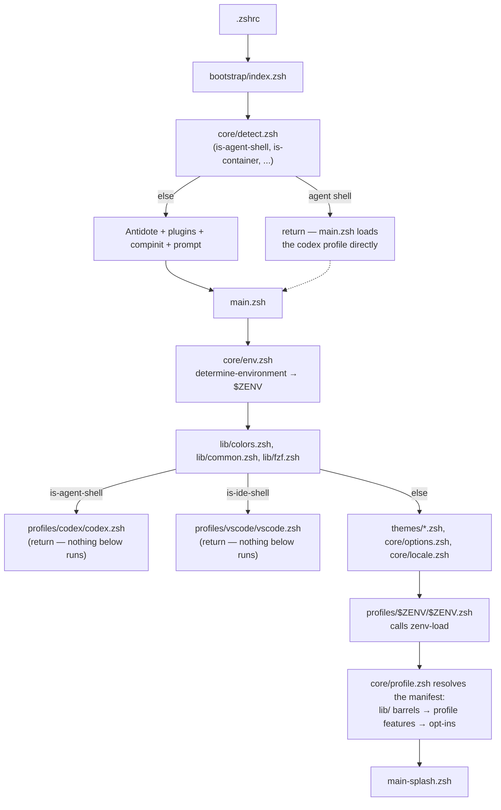

# Architecture

How this config is put together, and the rules that keep it that way. If
you're adding a file and unsure where it belongs, the table in
[Layers](#layers) answers it in one row.

## Boot sequence



`codex` and `vscode` are early exits from `main.zsh`, not profiles reached
through the manifest system below them — they never see the theme, options,
locale, or splash steps. This is deliberate: agent and IDE shells want to be
fast and quiet, not full interactive terminals.

## Layers

| Layer                                | Role                                                                          | May it cause side effects?                                              |
| ------------------------------------ | ----------------------------------------------------------------------------- | ----------------------------------------------------------------------- |
| `bootstrap/`                         | Ordered early init — profiling, Antidote, plugins, compinit, prompt           | **Yes** — that is its job. Order is load-bearing.                       |
| `core/`                              | zsh-level settings: options, history, keybindings, locale, env detection      | Settings only. No user-facing output, no network, no disk writes.       |
| `vendor/`                            | Third-party runtime init and `PATH` (`nvm`, `pnpm`)                           | Only `PATH`/env exports for the tool it owns.                           |
| `lib/<domain>.zsh` + `lib/<domain>/` | Barrel + leaf modules. **Definitions only** — functions, aliases, completions | **No.** Sourcing must be inert.                                         |
| `profiles/<name>/`                   | Host-specific paths, aliases, banner, opt-in features                         | **Yes, and only here** (plus `main.zsh`).                               |
| `extras/`                            | Opt-in: music, hardware, examples. Never auto-sourced                         | N/A — not on the load path.                                             |
| `packages/zconf/`                    | Maintainer CLI (TypeScript). Invoked deliberately, never on boot              | N/A — not on the load path; must work with Node absent everywhere else. |

**The rule that matters:** sourcing anything under `lib/` must not run
anything. If a module does work today, that work becomes a named function, and
the _profile_ decides whether to call it — that's what makes the config safe
for a stranger to try. `zconf doctor` lints this rule statically (the
`lib-side-effect` finding); `tests/test-lib-inert.zsh` proves it empirically on
whatever machine CI runs on.

## One source of truth per fact

Each of these lives in exactly **one** place. A duplicate is a bug, not a
style choice — delete it, don't synchronise it.

| Fact                                            | Owner                                                                                                                       |
| ----------------------------------------------- | --------------------------------------------------------------------------------------------------------------------------- |
| Which environment this is                       | `core/env.zsh`'s `determine-environment` (via `core/detect.zsh`'s predicates) — sets `$ZENV` once, everything else reads it |
| Colors                                          | `lib/colors.zsh` — `${_c}`-style vars, guarded so re-sourcing is free                                                       |
| Node / nvm / pnpm boot                          | The `node` module in `core/profile.zsh`'s registry (see [PATH ownership](#path-ownership))                                  |
| Comment-block style, function-naming convention | `zconf doctor` (enforced) + `docs/CONVENTIONS.md` (explained)                                                               |

## Profiles declare, the loader resolves

A profile is a manifest, not a script:

```zsh
ZENV_PRESET=full                 # full | minimal | container | none
ZENV_MODULES=(llms macos ghostty)
ZENV_FEATURES=(backups aliases dev)
ZENV_OPT_IN=(music/backup-dj-crate)

zenv-load
```

`core/profile.zsh` owns two things a profile is deliberately not trusted
with:

- **Load order.** Modules are sourced in the canonical order the registry
  defines, not the order a profile happened to list them — `colors` must
  precede anything using `${_c}`, `node`'s boot sequence must precede
  `lib/node.zsh`.
- **The nvm invariant.** `lib/node/nvm-autoload.zsh` silently no-ops if
  `nvm_find_nvmrc` doesn't exist yet, so `vendor/nvm.zsh` has to load first.
  Three profiles used to hand-roll this, three different ways; now it can't be
  gotten wrong per-profile.

An unknown module or feature name fails loudly (`zenv-validate`), not
silently — a typo in a manifest should never resolve to "did nothing."

Adding a host is a ~15-line file, not a copy-pasted 160-line one. See
`docs/PROFILES.md` for the worked walkthrough.

## PATH ownership

Exactly one layer may append to `$PATH` for a given kind of entry:

| Kind of path                                      | Owner                                                               |
| ------------------------------------------------- | ------------------------------------------------------------------- |
| Tool runtime paths (`nvm`, `pnpm`)                | `vendor/*.zsh`                                                      |
| OS-level paths (Homebrew prefix, coreutils, etc.) | `lib/paths/paths.<os>.zsh`                                          |
| Host-specific paths                               | `profiles/<name>/<name>.paths.zsh` (or inline in the profile entry) |

`bootstrap/index.zsh` runs `typeset -U path PATH` once, early — this
deduplicates for the whole session natively, so nothing downstream needs to
worry about double entries. Nothing outside the three rows above should append
to `PATH` on the load path; if you find an append somewhere else, it's a bug.

## Startup budget

Full interactive shell **< 400 ms**, minimal profiles (vscode/codex/docker)
**< 150 ms**. `scripts/bench-startup.zsh` measures it; CI's `startup-budget`
job asserts codex is meaningfully faster than a full profile (a ratio check,
not an absolute one — see `docs/benchmarks/README.md` for why absolute numbers
from a shared CI runner aren't trustworthy on their own). Details and the
current numbers live in `docs/PERFORMANCE.md`.

## Public means portable

No hardcoded usernames, emails, IPs, machine names, or absolute `/Users/<you>`
paths on the load path. Anything personal comes from `.env` (gitignored) or a
local override — never a literal in a tracked file. `zconf scan` and CI's
`secret-scan` job both check for this on every push.

## The real graph

The diagram above is the concept; this is the literal one — every `source`
statement and every manifest-resolved module/feature, generated straight from
the tracked files by `zconf graph`, so it cannot drift the way a hand-drawn
diagram would. Solid arrows are literal `source` lines; dashed arrows are
modules a profile's manifest resolves without one (`zenv-modules` sources
barrels through `core/profile.zsh`'s registry, not through a `source` line you
could grep for).

Regenerate after a structural change with `pnpm zconf graph --write`.

```mermaid
graph LR
  subgraph bootstrap
    bootstrap_00_profiling_zsh["bootstrap/00-profiling.zsh"]
    bootstrap_01_antidote_zsh["bootstrap/01-antidote.zsh"]
    bootstrap_02_plugins_zsh["bootstrap/02-plugins.zsh"]
    bootstrap_03_compinit_zsh["bootstrap/03-compinit.zsh"]
    bootstrap_04_prompt_zsh["bootstrap/04-prompt.zsh"]
    bootstrap_index_zsh["bootstrap/index.zsh"]
  end
  subgraph core
    core_detect_zsh["core/detect.zsh"]
    core_env_zsh["core/env.zsh"]
    core_history_zsh["core/history.zsh"]
    core_keybindings_zsh["core/keybindings.zsh"]
    core_locale_zsh["core/locale.zsh"]
    core_options_zsh["core/options.zsh"]
    core_profile_zsh["core/profile.zsh"]
  end
  subgraph entry
    main_splash_zsh["main-splash.zsh"]
    main_zsh["main.zsh"]
  end
  subgraph extras
    extras_music_backup_dj_crate_zsh["extras/music/backup-dj-crate.zsh"]
    extras_music_djay_icloud_sync_zsh["extras/music/djay_icloud_sync.zsh"]
  end
  subgraph lib
    lib_clean_zsh["lib/clean.zsh"]
    lib_clean_clean_browsers_zsh["lib/clean/clean.browsers.zsh"]
    lib_clean_clean_downloads_zsh["lib/clean/clean.downloads.zsh"]
    lib_clean_clean_ides_zsh["lib/clean/clean.ides.zsh"]
    lib_clean_clean_node_zsh["lib/clean/clean.node.zsh"]
    lib_cli_zsh["lib/cli.zsh"]
    lib_cli_cli_listing_zsh["lib/cli/cli.listing.zsh"]
    lib_cli_cli_navigation_zsh["lib/cli/cli.navigation.zsh"]
    lib_colors_zsh["lib/colors.zsh"]
    lib_common_zsh["lib/common.zsh"]
    lib_dev_zsh["lib/dev.zsh"]
    lib_dev_dev_workflow_zsh["lib/dev/dev.workflow.zsh"]
    lib_doctor_zsh["lib/doctor.zsh"]
    lib_fzf_zsh["lib/fzf.zsh"]
    lib_ghostty_zsh["lib/ghostty.zsh"]
    lib_git_zsh["lib/git.zsh"]
    lib_git_git_commit_zsh["lib/git/git.commit.zsh"]
    lib_git_git_core_zsh["lib/git/git.core.zsh"]
    lib_git_git_maintenance_zsh["lib/git/git.maintenance.zsh"]
    lib_git_git_rebase_zsh["lib/git/git.rebase.zsh"]
    lib_git_git_stashes_zsh["lib/git/git.stashes.zsh"]
    lib_git_git_submodule_zsh["lib/git/git.submodule.zsh"]
    lib_git_git_tags_zsh["lib/git/git.tags.zsh"]
    lib_llms_zsh["lib/llms.zsh"]
    lib_macos_zsh["lib/macos.zsh"]
    lib_macos_macos_brew_zsh["lib/macos/macos.brew.zsh"]
    lib_macos_macos_dock_zsh["lib/macos/macos.dock.zsh"]
    lib_macos_macos_media_zsh["lib/macos/macos.media.zsh"]
    lib_macos_macos_time_machine_zsh["lib/macos/macos.time-machine.zsh"]
    lib_node_zsh["lib/node.zsh"]
    lib_node_node_globals_zsh["lib/node/node.globals.zsh"]
    lib_node_nvm_autoload_zsh["lib/node/nvm-autoload.zsh"]
    lib_node_pnpm_zsh["lib/node/pnpm.zsh"]
    lib_paths_zsh["lib/paths.zsh"]
    lib_paths_paths_android_zsh["lib/paths/paths.android.zsh"]
    lib_paths_paths_linux_zsh["lib/paths/paths.linux.zsh"]
    lib_paths_paths_macos_zsh["lib/paths/paths.macos.zsh"]
    lib_splash_zsh["lib/splash.zsh"]
    lib_utils_zsh["lib/utils.zsh"]
    lib_utils_disk_zsh["lib/utils/disk.zsh"]
    lib_zconf_zsh["lib/zconf.zsh"]
  end
  subgraph profiles
    profiles_android_android_banner_zsh["profiles/android/android.banner.zsh"]
    profiles_android_android_zsh["profiles/android/android.zsh"]
    profiles_codex_codex_dev_zsh["profiles/codex/codex.dev.zsh"]
    profiles_codex_codex_zsh["profiles/codex/codex.zsh"]
    profiles_docker_dev_docker_dev_aliases_zsh["profiles/docker-dev/docker-dev.aliases.zsh"]
    profiles_docker_dev_docker_dev_banner_zsh["profiles/docker-dev/docker-dev.banner.zsh"]
    profiles_docker_dev_docker_dev_dev_zsh["profiles/docker-dev/docker-dev.dev.zsh"]
    profiles_docker_dev_docker_dev_zsh["profiles/docker-dev/docker-dev.zsh"]
    profiles_home_linux_home_linux_dev_zsh["profiles/home-linux/home-linux.dev.zsh"]
    profiles_home_linux_home_linux_hardware_zsh["profiles/home-linux/home-linux.hardware.zsh"]
    profiles_home_linux_home_linux_zsh["profiles/home-linux/home-linux.zsh"]
    profiles_home_macos_home_macos_aliases_zsh["profiles/home-macos/home-macos.aliases.zsh"]
    profiles_home_macos_home_macos_backups_zsh["profiles/home-macos/home-macos.backups.zsh"]
    profiles_home_macos_home_macos_dev_zsh["profiles/home-macos/home-macos.dev.zsh"]
    profiles_home_macos_home_macos_zsh["profiles/home-macos/home-macos.zsh"]
    profiles_office_macos_office_macos_aliases_zsh["profiles/office-macos/office-macos.aliases.zsh"]
    profiles_office_macos_office_macos_dev_zsh["profiles/office-macos/office-macos.dev.zsh"]
    profiles_office_macos_office_macos_zsh["profiles/office-macos/office-macos.zsh"]
    profiles_server_linux_server_linux_aliases_zsh["profiles/server-linux/server-linux.aliases.zsh"]
    profiles_server_linux_server_linux_banner_zsh["profiles/server-linux/server-linux.banner.zsh"]
    profiles_server_linux_server_linux_dev_zsh["profiles/server-linux/server-linux.dev.zsh"]
    profiles_server_linux_server_linux_zsh["profiles/server-linux/server-linux.zsh"]
    profiles_vscode_vscode_dev_zsh["profiles/vscode/vscode.dev.zsh"]
    profiles_vscode_vscode_zsh["profiles/vscode/vscode.zsh"]
  end
  subgraph scripts
    scripts_docker_cleanup_zsh["scripts/docker-cleanup.zsh"]
  end
  subgraph tests
    tests_test_profile_loader_zsh["tests/test-profile-loader.zsh"]
    tests_test_zupdate_zsh["tests/test-zupdate.zsh"]
  end
  subgraph themes
    themes_default_theme_zsh["themes/default.theme.zsh"]
    themes_prompt_zsh["themes/prompt.zsh"]
    themes_themes_functions_zsh["themes/themes.functions.zsh"]
  end
  subgraph update-config.zsh
    update_config_zsh["update-config.zsh"]
  end
  subgraph vendor
    vendor_nvm_zsh["vendor/nvm.zsh"]
    vendor_pnpm_path_zsh["vendor/pnpm-path.zsh"]
  end
  bootstrap_00_profiling_zsh --> core_history_zsh
  bootstrap_index_zsh --> core_detect_zsh
  bootstrap_index_zsh --> lib_colors_zsh
  bootstrap_index_zsh --> bootstrap_00_profiling_zsh
  bootstrap_index_zsh --> bootstrap_03_compinit_zsh
  bootstrap_index_zsh --> bootstrap_01_antidote_zsh
  bootstrap_index_zsh --> bootstrap_02_plugins_zsh
  bootstrap_index_zsh --> bootstrap_04_prompt_zsh
  core_env_zsh --> core_detect_zsh
  core_options_zsh --> core_keybindings_zsh
  lib_clean_zsh --> lib_colors_zsh
  lib_clean_zsh --> lib_clean_clean_downloads_zsh
  lib_clean_zsh --> lib_clean_clean_browsers_zsh
  lib_clean_zsh --> lib_clean_clean_ides_zsh
  lib_clean_zsh --> lib_clean_clean_node_zsh
  lib_clean_clean_browsers_zsh --> lib_colors_zsh
  lib_clean_clean_downloads_zsh --> lib_colors_zsh
  lib_clean_clean_ides_zsh --> lib_colors_zsh
  lib_clean_clean_node_zsh --> lib_colors_zsh
  lib_cli_zsh --> lib_cli_cli_listing_zsh
  lib_cli_zsh --> lib_cli_cli_navigation_zsh
  lib_cli_cli_listing_zsh --> lib_colors_zsh
  lib_common_zsh --> lib_cli_zsh
  lib_dev_zsh --> lib_dev_dev_workflow_zsh
  lib_dev_dev_workflow_zsh --> lib_colors_zsh
  lib_doctor_zsh --> lib_colors_zsh
  lib_git_zsh --> lib_git_git_core_zsh
  lib_git_zsh --> lib_git_git_commit_zsh
  lib_git_zsh --> lib_git_git_rebase_zsh
  lib_git_zsh --> lib_git_git_maintenance_zsh
  lib_git_zsh --> lib_git_git_submodule_zsh
  lib_git_zsh --> lib_git_git_stashes_zsh
  lib_git_zsh --> lib_git_git_tags_zsh
  lib_git_git_commit_zsh --> lib_colors_zsh
  lib_git_git_core_zsh --> lib_colors_zsh
  lib_git_git_maintenance_zsh --> lib_colors_zsh
  lib_git_git_rebase_zsh --> lib_colors_zsh
  lib_git_git_stashes_zsh --> lib_colors_zsh
  lib_git_git_tags_zsh --> lib_colors_zsh
  lib_macos_zsh --> lib_macos_macos_brew_zsh
  lib_macos_zsh --> lib_macos_macos_dock_zsh
  lib_macos_zsh --> lib_macos_macos_time_machine_zsh
  lib_macos_zsh --> lib_macos_macos_media_zsh
  lib_macos_macos_time_machine_zsh --> lib_colors_zsh
  lib_node_zsh --> lib_node_nvm_autoload_zsh
  lib_node_zsh --> lib_node_pnpm_zsh
  lib_node_zsh --> lib_node_node_globals_zsh
  lib_paths_zsh --> lib_paths_paths_macos_zsh
  lib_paths_zsh --> lib_paths_paths_linux_zsh
  lib_paths_zsh --> lib_paths_paths_android_zsh
  lib_splash_zsh --> lib_colors_zsh
  lib_utils_zsh --> lib_colors_zsh
  lib_zconf_zsh --> lib_colors_zsh
  main_splash_zsh --> lib_splash_zsh
  main_zsh --> core_env_zsh
  main_zsh --> core_profile_zsh
  main_zsh --> lib_colors_zsh
  main_zsh --> lib_common_zsh
  main_zsh --> lib_fzf_zsh
  main_zsh --> profiles_codex_codex_zsh
  main_zsh --> themes_default_theme_zsh
  main_zsh --> themes_themes_functions_zsh
  main_zsh --> themes_prompt_zsh
  main_zsh --> core_options_zsh
  main_zsh --> core_locale_zsh
  main_zsh --> profiles_vscode_vscode_zsh
  main_zsh --> main_splash_zsh
  profiles_android_android_banner_zsh --> lib_colors_zsh
  profiles_docker_dev_docker_dev_aliases_zsh --> lib_colors_zsh
  profiles_docker_dev_docker_dev_banner_zsh --> lib_colors_zsh
  profiles_home_linux_home_linux_dev_zsh --> lib_colors_zsh
  profiles_home_macos_home_macos_zsh --> scripts_docker_cleanup_zsh
  profiles_office_macos_office_macos_dev_zsh --> lib_colors_zsh
  profiles_server_linux_server_linux_banner_zsh --> lib_colors_zsh
  tests_test_profile_loader_zsh --> core_profile_zsh
  tests_test_zupdate_zsh --> update_config_zsh
  update_config_zsh --> lib_colors_zsh
  profiles_android_android_zsh -.-> lib_colors_zsh
  profiles_android_android_zsh -.-> lib_paths_zsh
  profiles_android_android_zsh -.-> lib_utils_zsh
  profiles_android_android_zsh -.-> lib_git_zsh
  profiles_android_android_zsh -.-> vendor_pnpm_path_zsh
  profiles_android_android_zsh -.-> vendor_nvm_zsh
  profiles_android_android_zsh -.-> lib_node_zsh
  profiles_android_android_zsh -.-> lib_dev_zsh
  profiles_codex_codex_zsh -.-> lib_colors_zsh
  profiles_codex_codex_zsh -.-> vendor_pnpm_path_zsh
  profiles_codex_codex_zsh -.-> vendor_nvm_zsh
  profiles_codex_codex_zsh -.-> lib_node_zsh
  profiles_codex_codex_zsh -.-> profiles_codex_codex_dev_zsh
  profiles_docker_dev_docker_dev_zsh -.-> lib_colors_zsh
  profiles_docker_dev_docker_dev_zsh -.-> lib_utils_zsh
  profiles_docker_dev_docker_dev_zsh -.-> lib_git_zsh
  profiles_docker_dev_docker_dev_zsh -.-> vendor_pnpm_path_zsh
  profiles_docker_dev_docker_dev_zsh -.-> vendor_nvm_zsh
  profiles_docker_dev_docker_dev_zsh -.-> lib_node_zsh
  profiles_docker_dev_docker_dev_zsh -.-> lib_dev_zsh
  profiles_docker_dev_docker_dev_zsh -.-> profiles_docker_dev_docker_dev_aliases_zsh
  profiles_docker_dev_docker_dev_zsh -.-> profiles_docker_dev_docker_dev_dev_zsh
  profiles_home_linux_home_linux_zsh -.-> lib_colors_zsh
  profiles_home_linux_home_linux_zsh -.-> lib_paths_zsh
  profiles_home_linux_home_linux_zsh -.-> lib_common_zsh
  profiles_home_linux_home_linux_zsh -.-> lib_utils_zsh
  profiles_home_linux_home_linux_zsh -.-> lib_utils_disk_zsh
  profiles_home_linux_home_linux_zsh -.-> lib_doctor_zsh
  profiles_home_linux_home_linux_zsh -.-> lib_fzf_zsh
  profiles_home_linux_home_linux_zsh -.-> lib_git_zsh
  profiles_home_linux_home_linux_zsh -.-> vendor_pnpm_path_zsh
  profiles_home_linux_home_linux_zsh -.-> vendor_nvm_zsh
  profiles_home_linux_home_linux_zsh -.-> lib_node_zsh
  profiles_home_linux_home_linux_zsh -.-> lib_dev_zsh
  profiles_home_linux_home_linux_zsh -.-> lib_clean_zsh
  profiles_home_linux_home_linux_zsh -.-> lib_zconf_zsh
  profiles_home_linux_home_linux_zsh -.-> profiles_home_linux_home_linux_hardware_zsh
  profiles_home_linux_home_linux_zsh -.-> profiles_home_linux_home_linux_dev_zsh
  profiles_home_macos_home_macos_zsh -.-> lib_colors_zsh
  profiles_home_macos_home_macos_zsh -.-> lib_paths_zsh
  profiles_home_macos_home_macos_zsh -.-> lib_common_zsh
  profiles_home_macos_home_macos_zsh -.-> lib_utils_zsh
  profiles_home_macos_home_macos_zsh -.-> lib_utils_disk_zsh
  profiles_home_macos_home_macos_zsh -.-> lib_doctor_zsh
  profiles_home_macos_home_macos_zsh -.-> lib_fzf_zsh
  profiles_home_macos_home_macos_zsh -.-> lib_git_zsh
  profiles_home_macos_home_macos_zsh -.-> vendor_pnpm_path_zsh
  profiles_home_macos_home_macos_zsh -.-> vendor_nvm_zsh
  profiles_home_macos_home_macos_zsh -.-> lib_node_zsh
  profiles_home_macos_home_macos_zsh -.-> lib_dev_zsh
  profiles_home_macos_home_macos_zsh -.-> lib_llms_zsh
  profiles_home_macos_home_macos_zsh -.-> lib_clean_zsh
  profiles_home_macos_home_macos_zsh -.-> lib_macos_zsh
  profiles_home_macos_home_macos_zsh -.-> lib_ghostty_zsh
  profiles_home_macos_home_macos_zsh -.-> lib_zconf_zsh
  profiles_home_macos_home_macos_zsh -.-> profiles_home_macos_home_macos_backups_zsh
  profiles_home_macos_home_macos_zsh -.-> profiles_home_macos_home_macos_aliases_zsh
  profiles_home_macos_home_macos_zsh -.-> profiles_home_macos_home_macos_dev_zsh
  profiles_home_macos_home_macos_zsh -.-> extras_music_backup_dj_crate_zsh
  profiles_home_macos_home_macos_zsh -.-> extras_music_djay_icloud_sync_zsh
  profiles_office_macos_office_macos_zsh -.-> lib_colors_zsh
  profiles_office_macos_office_macos_zsh -.-> lib_paths_zsh
  profiles_office_macos_office_macos_zsh -.-> lib_common_zsh
  profiles_office_macos_office_macos_zsh -.-> lib_utils_zsh
  profiles_office_macos_office_macos_zsh -.-> lib_utils_disk_zsh
  profiles_office_macos_office_macos_zsh -.-> lib_doctor_zsh
  profiles_office_macos_office_macos_zsh -.-> lib_fzf_zsh
  profiles_office_macos_office_macos_zsh -.-> lib_git_zsh
  profiles_office_macos_office_macos_zsh -.-> vendor_pnpm_path_zsh
  profiles_office_macos_office_macos_zsh -.-> vendor_nvm_zsh
  profiles_office_macos_office_macos_zsh -.-> lib_node_zsh
  profiles_office_macos_office_macos_zsh -.-> lib_dev_zsh
  profiles_office_macos_office_macos_zsh -.-> lib_clean_zsh
  profiles_office_macos_office_macos_zsh -.-> lib_macos_zsh
  profiles_office_macos_office_macos_zsh -.-> lib_ghostty_zsh
  profiles_office_macos_office_macos_zsh -.-> lib_zconf_zsh
  profiles_office_macos_office_macos_zsh -.-> profiles_office_macos_office_macos_aliases_zsh
  profiles_office_macos_office_macos_zsh -.-> profiles_office_macos_office_macos_dev_zsh
  profiles_server_linux_server_linux_zsh -.-> lib_colors_zsh
  profiles_server_linux_server_linux_zsh -.-> lib_paths_zsh
  profiles_server_linux_server_linux_zsh -.-> lib_common_zsh
  profiles_server_linux_server_linux_zsh -.-> lib_utils_zsh
  profiles_server_linux_server_linux_zsh -.-> lib_utils_disk_zsh
  profiles_server_linux_server_linux_zsh -.-> lib_doctor_zsh
  profiles_server_linux_server_linux_zsh -.-> lib_fzf_zsh
  profiles_server_linux_server_linux_zsh -.-> lib_git_zsh
  profiles_server_linux_server_linux_zsh -.-> vendor_pnpm_path_zsh
  profiles_server_linux_server_linux_zsh -.-> vendor_nvm_zsh
  profiles_server_linux_server_linux_zsh -.-> lib_node_zsh
  profiles_server_linux_server_linux_zsh -.-> lib_dev_zsh
  profiles_server_linux_server_linux_zsh -.-> lib_clean_zsh
  profiles_server_linux_server_linux_zsh -.-> lib_zconf_zsh
  profiles_server_linux_server_linux_zsh -.-> profiles_server_linux_server_linux_aliases_zsh
  profiles_server_linux_server_linux_zsh -.-> profiles_server_linux_server_linux_dev_zsh
  profiles_vscode_vscode_zsh -.-> lib_colors_zsh
  profiles_vscode_vscode_zsh -.-> lib_git_zsh
  profiles_vscode_vscode_zsh -.-> vendor_pnpm_path_zsh
  profiles_vscode_vscode_zsh -.-> vendor_nvm_zsh
  profiles_vscode_vscode_zsh -.-> lib_node_zsh
  profiles_vscode_vscode_zsh -.-> lib_dev_zsh
  profiles_vscode_vscode_zsh -.-> profiles_vscode_vscode_dev_zsh
```

<!-- zconf:graph:start -->



<!-- zconf:graph:end -->

Or scope it to one profile's resolved load order, in the order it actually
loads:

```console
$ pnpm zconf graph --profile codex
codex resolved load order:

  ✔  1. lib/colors.zsh
  ✔  2. vendor/nvm.zsh
  ✔  3. vendor/pnpm-path.zsh
  ✔  4. lib/node.zsh
  ✔  5. profiles/codex/codex.dev.zsh
```
